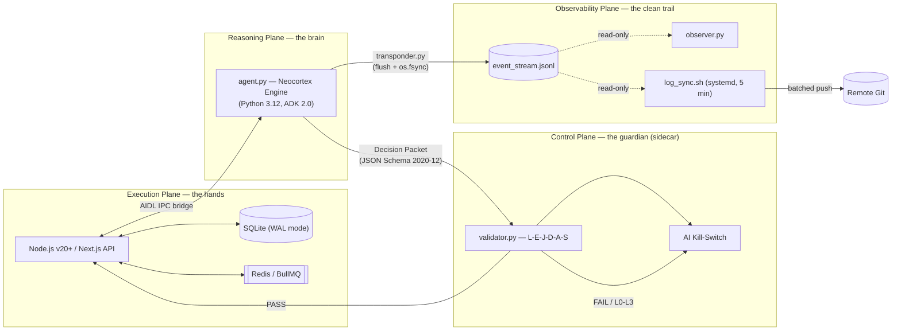

# META-CORE MVP — Deterministic Architecture for Industrial AI Agents

META-CORE is an architectural blueprint for deploying autonomous AI agents in
industrial settings where **safety, auditability, and determinism** matter
more than raw model capability. It achieves this through a strict separation
of concerns — an LLM-driven **Reasoning Plane** never holds the credentials
or network access needed to touch production state directly. Every proposed
action is compiled into a schema-validated **Decision Packet**, checked by an
air-gapped **Control Plane** sidecar, and only then handed to a high-speed
**Execution Plane** for commit.

This repository is the technical documentation for that architecture: system
topology, the Perceive-Think-Act-Check (PTAC) planning loop, the safety
gateway, the telemetry pipeline, deployment requirements, and the
architecture decisions behind each of them.

> **Status:** Blueprint / MVP design documentation. Several interfaces
> (the AIDL IPC contract, the L0–L3 escalation thresholds, the sidecar
> transport protocol) are referenced throughout but not yet fully specified.
> These are tracked explicitly in [`docs/open-questions.md`](docs/open-questions.md)
> rather than left implicit.

## Why operational planes

A single-process agent that can read a prompt, call an LLM, and also hold
database credentials is one prompt-injection away from an unauthorized write.
META-CORE removes that risk architecturally rather than relying on model
behavior: the plane that *thinks* is physically unable to reach the plane
that *mutates state* without passing through a plane that *validates*.

## Documentation map

| Section | What's there |
|---|---|
| [`docs/architecture/overview.md`](docs/architecture/overview.md) | The four operational planes, topology, and the PTAC state model |
| [`docs/architecture/execution-plane.md`](docs/architecture/execution-plane.md) | Node.js/Next.js, SQLite WAL, Redis/BullMQ — the tightly-coupled state layer |
| [`docs/architecture/reasoning-plane.md`](docs/architecture/reasoning-plane.md) | `agent.py`, the Neocortex Engine, and the sandboxed PTAC cycle |
| [`docs/architecture/control-plane.md`](docs/architecture/control-plane.md) | `validator.py`, the L-E-J-D-A-S framework, and the AI Kill-Switch |
| [`docs/architecture/observability-plane.md`](docs/architecture/observability-plane.md) | `event_stream.jsonl`, `observer.py`, `log_sync.sh`, the "Clean Trail" |
| [`docs/architecture/data-architecture.md`](docs/architecture/data-architecture.md) | Knowledge Objects (EGDS), SHA-256 fact IDs, Zod / JSON Schema validation |
| [`docs/architecture/component-connectivity.md`](docs/architecture/component-connectivity.md) | Where the system is tightly coupled vs. loosely coupled, and why |
| [`docs/deployment/requirements.md`](docs/deployment/requirements.md) | Node.js v20+, Python 3.12, Git 2.30+, Docker Compose |
| [`docs/deployment/assembly-stages.md`](docs/deployment/assembly-stages.md) | The 5-stage cascaded deployment plan |
| [`docs/decisions/`](docs/decisions/README.md) | Architecture Decision Records (ADRs) — the trade-offs behind each boundary |
| [`docs/audits/`](docs/audits/README.md) | Recorded external/internal reviews and counter-proposals, not yet adopted as ADRs |
| [`docs/security/l-e-j-d-a-s-framework.md`](docs/security/l-e-j-d-a-s-framework.md) | The six-field safety gate and the L0–L3 escalation ladder |
| [`docs/security/audit-protocol.md`](docs/security/audit-protocol.md) | Isolation, integrity, and failure-mode audit checklist |
| [`docs/roadmap.md`](docs/roadmap.md) | Cascaded implementation roadmap, stage by stage |
| [`docs/articles/anatomy-of-a-safe-agent.md`](docs/articles/anatomy-of-a-safe-agent.md) | Narrative walkthrough of the operational-planes model |
| [`docs/articles/ptac-loop-journey.md`](docs/articles/ptac-loop-journey.md) | Narrative walkthrough of one Decision Packet's life cycle |
| [`docs/open-questions.md`](docs/open-questions.md) | Every gap the source design left unspecified, consolidated |
| [`docs/glossary.md`](docs/glossary.md) | KO, PTAC, AIDL, EGDS and other terms defined once |

## Core design pillars

- **Isolation** — the Reasoning Plane sandbox has blocked network sockets and
  zero database credentials; it can propose, never mutate.
- **Validation** — every Decision Packet is checked against JSON Schema
  2020-12 and the L-E-J-D-A-S safety framework in an out-of-process sidecar
  before it can reach the Execution Plane.
- **Determinism** — Knowledge Object IDs are derived as
  `SHA-256(subject || predicate)`, making duplicate or hallucinated facts
  structurally impossible to insert twice.
- **Auditability** — every step is appended to `event_stream.jsonl` with an
  atomic `flush + os.fsync`, giving a tamper-resistant "Clean Trail" even
  across a hard crash.
- **Performance where it's safe to have it** — the Execution Plane is
  deliberately *tightly* coupled (Next.js, SQLite WAL, Redis/BullMQ) to hit
  sub-100ms CRUD latency; everything that touches the model is deliberately
  *loosely* coupled to contain a compromise.

## Tech stack at a glance

| Plane | Stack |
|---|---|
| Execution | Node.js v20+ (LTS), Next.js, TypeScript, SQLite (WAL), Redis, BullMQ, Zod |
| Reasoning | Python 3.12, `agent.py`, ADK 2.0, JSON Schema 2020-12, `cryptography` (Ed25519) |
| Control | Python, `validator.py`, isolated sidecar container |
| Observability | Bash, Python (`transponder.py`, `observer.py`), `log_sync.sh`, Git 2.30+, systemd timers |
