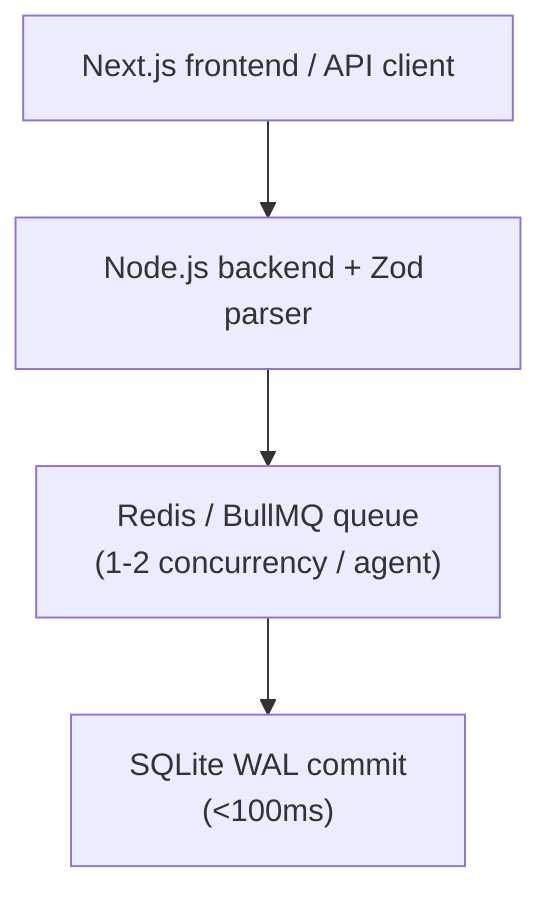
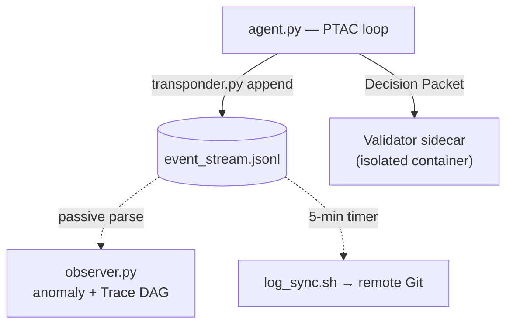

# Component Connectivity

META-CORE runs a deliberately **hybrid coupling model**: tight integration
inside the Execution Plane's web stack for latency, and loose coupling
everywhere the Reasoning Plane is involved, for safety.

| Component A | Component B | Coupling | Transport | Purpose |
|---|---|---|---|---|
| Node.js API Backend | SQLite / Redis / BullMQ | **Tight** | In-process / local socket | Sub-100ms CRUD latency |
| Node.js API Backend | `agent.py` | Decoupled | AIDL IPC bridge | Gateway ↔ Executor coordination |
| `agent.py` | `observer.py` | **Low** | `event_stream.jsonl` (append-only) | Passive, non-blocking telemetry |
| Reasoning sandbox | Validator & Kill-Switch | **Isolated** | Sidecar process boundary | Prompt-injection containment |
| SQLite (WAL) | Observability Plane | **Low** | Concurrent read-only query | Non-blocking parallel reads |

## Tight coupling: the execution web-stack

Next.js, the Node.js API, SQLite (WAL), and Redis/BullMQ are integrated as a
single monolithic core specifically so no serialization boundary sits
between an inbound request and a committed transaction. This is the *only*
tightly-coupled subsystem in the architecture, and it's bounded strictly to
components that never take direct instructions from the LLM.

## Low coupling: reasoning, control, and observability

Everything that touches model reasoning talks to its neighbors only through
files, schemas, or a sidecar boundary — never a shared socket or shared
memory space.

The trade-off: an observability crash or a Git sync failure cannot cascade
back to freeze the agent or the API, but real-time loop-interdiction from
`observer.py` is not possible — active loop-killing is reserved for the
out-of-process AI Kill-Switch instead. See
[Control Plane](control-plane.md#ai-kill-switch).

## Security isolation summary

| Boundary | What it stops |
|---|---|
| Reasoning sandbox ↔ network/DB | Data exfiltration, direct SQL injection |
| Reasoning sandbox ↔ Control sidecar | A jailbroken model disabling its own safety limits |
| Execution Plane ↔ Reasoning Plane | Unvalidated/hallucinated state mutation |
| SQLite WAL ↔ Observability reads | Telemetry queries blocking live transactions |

## Open questions

- The AIDL interface contract mapping Gateway ↔ Executor data types.
- The network/socket transport used between the reasoning sandbox and the
  Control Plane sidecar (HTTP, Unix socket, gRPC).
- Formatting/corruption handling for `event_stream.jsonl` if a writer
  terminates mid-line.

See [`docs/open-questions.md`](../open-questions.md) for the full list, and
[`docs/decisions/`](../decisions/README.md) for the ADRs behind each coupling
choice.
