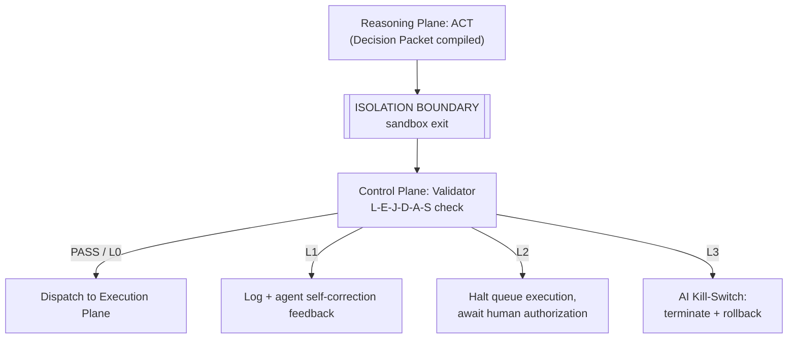

# Control Plane

The Control Plane is META-CORE's safety gateway. It runs **out-of-process**,
in an isolated sidecar container, specifically so that a compromised
Reasoning Plane cannot reach into it and disable its own guardrails. It has
two modules: the **Validator** (evaluates *what* the agent wants to do) and
the **AI Kill-Switch** (monitors *how* the agent is behaving).

## Why a sidecar, not in-process

| | In-process validation | Out-of-process sidecar (chosen) |
|---|---|---|
| Latency | Sub-millisecond | Minor IPC/serialization overhead |
| Security | A jailbroken model can potentially patch validator memory to force "pass" | Compromise of the reasoning sandbox has no path to the validator's memory space |
| Verdict | Rejected — see [ADR-0003](../decisions/0003-sidecar-isolated-safety-modules.md) | Adopted |

## Validator (`validator.py`)

Evaluates every Decision Packet against the six-field **L-E-J-D-A-S**
safety framework and assigns an **L0–L3 escalation level**. Full detail:
[`docs/security/l-e-j-d-a-s-framework.md`](../security/l-e-j-d-a-s-framework.md).

## AI Kill-Switch

Monitors runtime telemetry and forces an emergency stop when a bound is
breached:

| Signal | What it protects against |
|---|---|
| Execution time | Runaway / hung reasoning cycles |
| Memory footprint | Host resource exhaustion |
| Token consumption | Uncontrolled LLM billing |
| Cyclic / recursive loops | Infinite logical loops, redundant tool calls |

The Kill-Switch executes independently of the Reasoning Plane's health — it
can terminate the sandbox process even if the Python interpreter is
100% CPU-saturated or otherwise unresponsive.

## Validation gate in the PTAC flow

## Security properties

- **Prompt-injection containment** — safety rules cannot be reflected on or
  memory-patched from inside the reasoning sandbox.
- **Malformed payload defense** — non-conforming Decision Packets are
  dropped at the boundary, never reaching the database.
- **Escalation isolation** — L0–L3 tiers let the system respond
  proportionally instead of hard-crashing on every minor violation.
- **Fail-secure default** — if the sidecar loses its link to the Execution
  Plane, dispatches are blocked by default (architectural extrapolation —
  not yet confirmed in source material).

## Open questions

- The concrete evaluation logic and numeric thresholds distinguishing L0,
  L1, L2, and L3.
- The transport protocol (HTTP, Unix socket, gRPC) carrying Decision Packets
  from `agent.py` to the sidecar.
- The signal used to terminate the sandboxed agent process (`SIGKILL`,
  `SIGTERM`, or a webhook-style stop request).
- Rollback/state-recovery behavior for transactions cut off mid-flight by an
  L3 kill.

See [`docs/open-questions.md`](../open-questions.md) for the full list.
