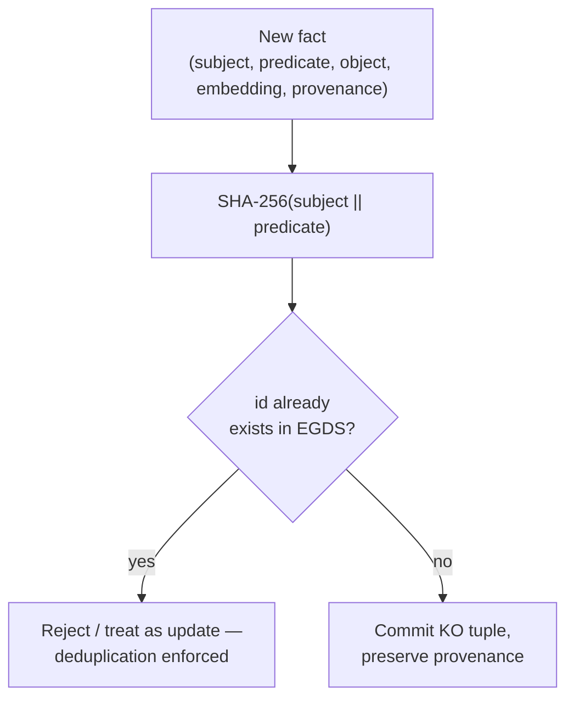
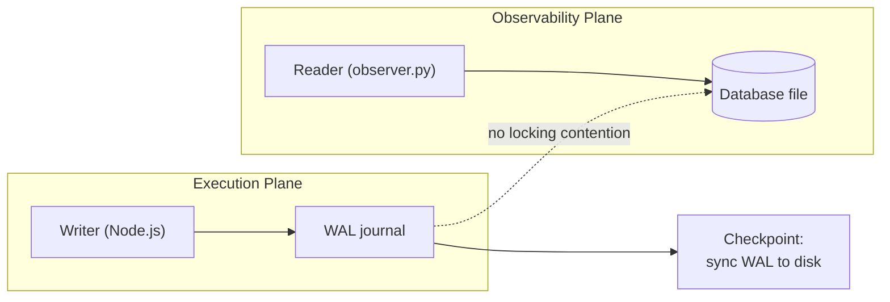

# Data Architecture

META-CORE segregates data across three storage mechanisms, each matched to
the plane that owns it:

| Store | Owning plane | Mechanism | Structure |
|---|---|---|---|
| EGDS Knowledge DB | Execution / Reasoning (read) | Relational / key-value tuples | `KO = (id, subject, predicate, object, embedding, provenance)` |
| Transaction DB | Execution | SQLite, Write-Ahead Logging (WAL) | Transactional metadata, queue state |
| Event ledger | Observability | Append-only local file (`event_stream.jsonl`) | Line-delimited JSON step events |

## Knowledge Objects and deterministic fact IDs

Every fact is stored as a **Knowledge Object (KO)**:

```
KO = (id, subject, predicate, object, embedding, provenance)
id = SHA-256(subject || predicate)
```



The `object` field is deliberately **excluded** from the hash. That lets the
system update the *value* of a known relationship (e.g. a sensor reading
changing) without minting a duplicate relational entry — the knowledge base
stays lean and semantically accurate instead of accumulating one row per
observation.

This is what makes the agent's "memory" resistant to hallucinated or
re-asserted facts: if the agent tries to re-learn an existing
subject/predicate pair, the computed ID collides with the existing row and
the write is rejected (or treated as an idempotent update), never
duplicated.

The `provenance` field itself is a fixed enum —
`ORGANIC_USER` / `SYNTHETIC_AGENT` / `VERIFIED_EXTERNAL` — not free text,
and any read path feeding strategy adaptation or analytics must filter to
`ORGANIC_USER`/`VERIFIED_EXTERNAL` by default. This stops the agent from
learning from its own synthetic output as if it were ground truth. See
[ADR-0013](../decisions/0013-provenance-typed-knowledge-objects.md).

## SQLite WAL mode

Standard SQLite journaling blocks readers during a write. META-CORE enables
**Write-Ahead Logging** specifically so the Observability Plane can run
read-only queries concurrently with the Execution Plane's writes, with zero
lock contention — see [ADR-0004](../decisions/0004-sqlite-wal-mode.md).



## Dual schema validation

Two validation frameworks guard the boundary between the Reasoning Plane's
free-form LLM output and the Execution Plane's typed database writes:

| Framework | Plane | Validates |
|---|---|---|
| JSON Schema 2020-12 | Reasoning / Control | Structure of the model's raw output → Decision Packet |
| Zod (TypeScript) | Execution | Type-safety of arguments immediately before a DB write |

Both are needed because they run in different languages on different sides
of the IPC boundary; keeping them in sync is an explicit open risk — see
[ADR-0006](../decisions/0006-dual-schema-validation.md).

## Vector search in the MVP

For the MVP, embeddings are stored as raw values inside the same SQLite
database rather than a dedicated vector index, trading maximum query
performance for deployment simplicity. See
[ADR-0010](../decisions/0010-sqlite-for-vector-storage-mvp.md) for the
trigger conditions to revisit this.

## Open questions

- The underlying engine for the EGDS Knowledge DB (plain relational tables,
  `pgvector`, or an embedded key-value store).
- The embedding pipeline — local model vs. external API — used to populate
  the `embedding` field.
- String normalization rules (casing, trimming, encoding) applied to
  `subject`/`predicate` before hashing.
- Fallback behavior on a SHA-256 collision.

See [`docs/open-questions.md`](../open-questions.md) for the full list.
