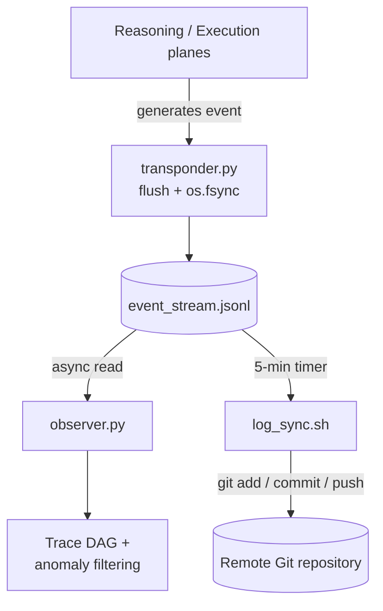

# Observability Plane

The Observability Plane implements the **"Clean Trail" (Чистый след)**
principle: every perception, thought, and action in the system is appended
to a single local, immutable ledger — `event_stream.jsonl` — which every
other observability component reads passively and asynchronously. Nothing
here has write access to any other plane.

## Components

| Component | Stack | Interface | Role |
|---|---|---|---|
| `transponder.py` | Python | Writes `event_stream.jsonl` | Atomic `flush + os.fsync` event logging |
| `event_stream.jsonl` | Append-only local file | Shared read interface | The single source of truth for system history |
| `observer.py` | Python | Read-only parsing | Groups events into per-run OpenTelemetry-style span trees and scores them (Tool-Call Accuracy, Agent-Goal Accuracy) — see [ADR-0015](../decisions/0015-claim-level-trace-evaluation.md) |
| `log_sync.sh` + `log-sync.timer` | Bash, systemd, Git 2.30+ | Read-only, batched push | Syncs the local log to a remote Git repository every 5 minutes |

## Durability: why `flush + os.fsync`

`transponder.py` performs an atomic `flush` followed by an `os.fsync` system
call on every write. This forces the OS to commit the event to physical disk
immediately — the log survives a kernel panic or power failure, which is a
non-negotiable requirement for industrial forensic auditing.

## Telemetry flow

## Why this is safe to crash

Because `observer.py` and `log_sync.sh` only ever *read* the event stream,
neither one can corrupt it, and neither one blocks the Execution or
Reasoning planes if it crashes. SQLite's **WAL mode** additionally lets
`observer.py` run heavy analytical queries against the transaction database
without locking active writes — see
[ADR-0004](../decisions/0004-sqlite-wal-mode.md).

## The 5-minute sync gap

Real-time, synchronous remote logging would block on network latency and
GitHub/GitLab rate limits, breaking the sub-100ms CRUD target. META-CORE
accepts eventual consistency for remote telemetry (max 5-minute lag) to keep
local execution fast. Full trade-off analysis:
[ADR-0001](../decisions/0001-decoupled-telemetry-sync.md).

## Claim-level trace evaluation

Span-level metrics (duration, cost) can show *that* a PTAC cycle failed but
not *why*. `agent.py` and the Control Plane sidecar each emit one span per
Perceive/Think/Act/Check phase, carrying the prompt, retrieved context, and
Decision Packet for that phase; `observer.py` assembles these into a
per-run span tree instead of scanning for statistical outliers. This
replaces the previously unspecified Huber Loss / Z-score filter — full
rationale and the two trace-level scoring metrics:
[ADR-0015](../decisions/0015-claim-level-trace-evaluation.md).

## Security properties

- **Tamper resistance** — a compromised Reasoning Plane has no socket or
  memory access to `observer.py`, so it cannot alter or delete telemetry.
- **Network fault isolation** — if the remote Git push fails, the local log
  is untouched and execution continues unblocked.
- **Rate-limit defense** — batching syncs to 5-minute windows keeps
  high-frequency PTAC loops from triggering GitHub/GitLab API throttling.

## Open questions

- File rotation / retention policy for `event_stream.jsonl` (unbounded
  growth risk under long-running deployments).
- Locking strategy in `transponder.py` for concurrent writers (multiple
  parallel agent processes).
- Authentication method `log_sync.sh` uses against the remote Git host
  (SSH deploy key vs. HTTPS token).
- Corruption handling for a truncated/incomplete write if a process dies
  mid-append.
- ~~Huber Loss / Z-score thresholds and Trace DAG output schema~~ —
  superseded by [ADR-0015](../decisions/0015-claim-level-trace-evaluation.md):
  the trace is now a standard OpenTelemetry span tree, and the filter is
  trace-level evaluation scoring instead of a statistical outlier cutoff.
- The pass/fail threshold for the Tool-Call Accuracy and Agent-Goal
  Accuracy scores introduced by ADR-0015 is not yet fixed.

See [`docs/open-questions.md`](../open-questions.md) for the full list.
