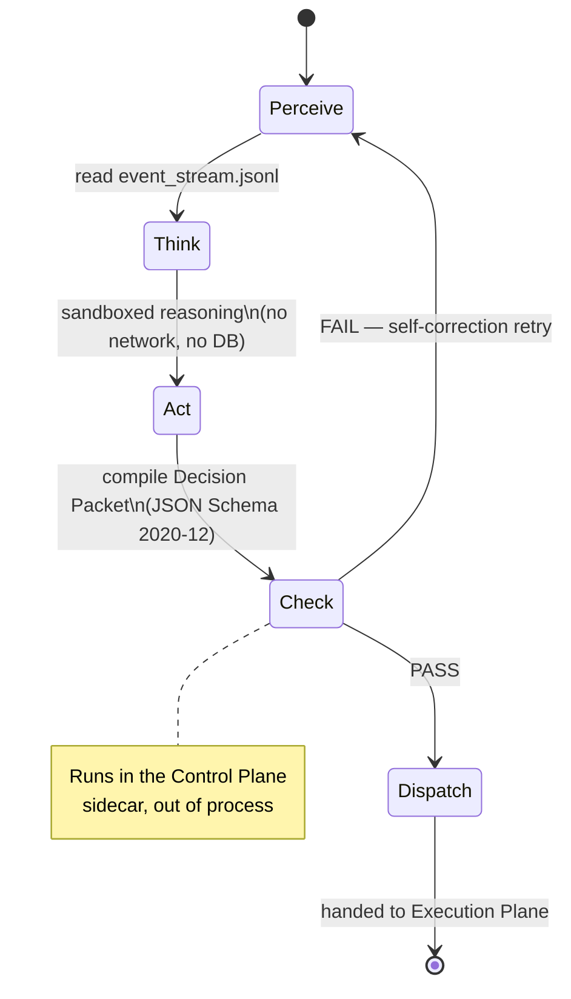

# Architecture Overview: Operational Planes

META-CORE divides agent operation into four operational planes. Each plane
has a distinct coupling profile, a distinct security boundary, and exactly
one way to talk to its neighbors. This is the primary defense-in-depth
mechanism of the whole system: a compromise in one plane cannot silently
become a privilege escalation in another, because there is no shared memory
space and no shared credential to escalate through.

## The four planes

| Plane | Role | Tech stack | Coupling | Data authority |
|---|---|---|---|---|
| **Execution** | The hands — state persistence, API orchestration, task queues | Next.js, Node.js v20+, SQLite (WAL), Redis/BullMQ | Tight (internal) | Exclusive database credentials |
| **Reasoning** | The brain — deterministic PTAC planning cycle | Python 3.12, `agent.py`, ADK 2.0 | Loose (to everything else) | None — zero DB credentials, no network sockets |
| **Control** | The guardian — validates and can kill | Python, `validator.py`, sidecar container | Isolated (own container) | Read-only on Decision Packets; write authority over process termination |
| **Observability** | The clean trail — passive telemetry | Bash, Python (`transponder.py`, `observer.py`), `log_sync.sh` | Loose, read-only | None — append-only local file, asynchronous remote sync |

See the dedicated page for each plane: [Execution](execution-plane.md) ·
[Reasoning](reasoning-plane.md) · [Control](control-plane.md) ·
[Observability](observability-plane.md). Data storage details live in
[Data Architecture](data-architecture.md); the coupling rationale is in
[Component Connectivity](component-connectivity.md).

## The PTAC state model

The Reasoning Plane's `NeocortexSystem1Engine` drives every planning cycle
through four deterministic phases:

1. **Perceive** — ingest current environmental and task context from the
   append-only `event_stream.jsonl`.
2. **Think** — reason inside the network-isolated Python sandbox.
3. **Act** — compile the reasoning output into a strict, JSON Schema
   2020-12-validated Decision Packet.
4. **Check** — hand the Decision Packet to the Control Plane sidecar, which
   evaluates it against the [L-E-J-D-A-S framework](../security/l-e-j-d-a-s-framework.md)
   before it can reach the Execution Plane.

## Why this shape mitigates the big three industrial risks

1. **Single points of failure** — a crash or hang in the LLM-driven
   Reasoning Plane cannot cascade into the transactional database, because
   the two run in separate processes with no shared credential.
2. **Prompt injection** — even a fully "jailbroken" model has no network
   sockets and no database keys to act on. It can only *propose* a Decision
   Packet; it has no channel to execute one directly.
3. **Unauthorized data mutation** — every state change is a schema-validated
   packet checked by an out-of-process validator. A hallucinated field or
   malformed structure is rejected before it is ever seen by the database.

## Cross-plane connectivity at a glance

| From | To | Mechanism | Coupling |
|---|---|---|---|
| Node.js API Backend | SQLite / Redis / BullMQ | In-process / local socket | Tight |
| Node.js API Backend | `agent.py` | AIDL IPC bridge | Decoupled, schema-gated |
| `agent.py` | `observer.py` | `event_stream.jsonl` (append-only) | Loose |
| Reasoning sandbox | Validator & Kill-Switch | Sidecar process boundary | Isolated |
| SQLite (WAL) | `observer.py` | Concurrent read-only query | Loose, lockless |

Full detail, including the open questions on transport protocols, is in
[Component Connectivity](component-connectivity.md).
