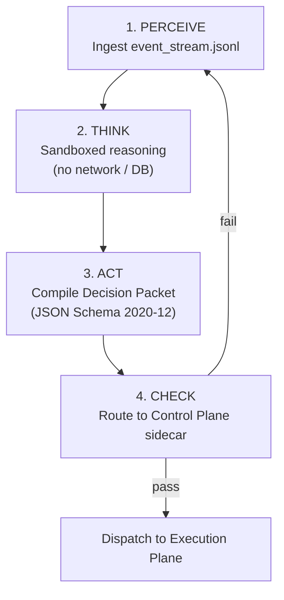

# Reasoning Plane

The Reasoning Plane is the isolated cognitive layer of META-CORE. It runs
`agent.py` — the `NeocortexSystem1Engine`, built on Python 3.12 and ADK 2.0 —
inside a sandbox that is structurally incapable of touching production state.
It communicates with the rest of the system in exactly two ways: reading the
append-only `event_stream.jsonl`, and emitting a schema-validated Decision
Packet.

## Environment

- **Python 3.12**, strictly required for native `datetime`
  `timezone.utc` handling and the `cryptography` primitives used for Ed25519
  signature verification of inbound AIDL commands.
- Runs inside a **Python virtual environment (venv)**, isolating dependencies
  such as `cryptography` and `numpy`.
- **Blocked raw network sockets** — no path to the open internet, except
  through the whitelisted egress proxy
  ([ADR-0009](../decisions/0009-egress-proxy-for-llm-calls.md)), which is
  itself implemented as an AI Gateway enforcing per-request spend ceilings
  ([ADR-0012](../decisions/0012-ai-gateway-egress-implementation.md)).
- **Zero database credentials** — no keys, no connection strings, for
  either SQLite or Redis.

## The PTAC cycle



| Phase | Action | Output |
|---|---|---|
| Perceive | Reads current environmental/task context from the append-only event log | Contextual snapshot |
| Think | Processes the payload inside the sandboxed runtime | Logical strategy |
| Act | Compiles the strategy into a strict JSON-Schema 2020-12 structure | Decision Packet |
| Check | Hands the packet to `validator.py` in the Control Plane sidecar | Approve / escalate signal |

## Context budgeting

Perceive doesn't hand Think an unbounded replay of `event_stream.jsonl`.
The context window is split into fixed bands — system prompt, tool
descriptions, retrieved context, history, and a reserved generation buffer
— so cost and attention degradation both stay bounded regardless of how
much history has accumulated. Full band allocation:
[ADR-0014](../decisions/0014-context-budgeting.md).

## Example Decision Packet

```json
{
  "action": "inventory_correction",
  "parameters": {
    "sku": "META-001",
    "adjustment": -10
  },
  "justification": "Correcting discrepancy noted in event log #882; actual count 40 vs system count 50."
}
```

If a field is missing, malformed, or hallucinated, schema validation rejects
the packet before it ever leaves the sandbox boundary — it never reaches the
database layer.

## Security properties

- **Network/DB air-gap** — a prompt-injection compromise here has nothing to
  exfiltrate and nowhere to write.
- **Command authenticity** — inbound AIDL instructions from the Node.js
  orchestrator are verified with Ed25519 signatures using the `cryptography`
  library.
- **Fact determinism** — Knowledge Objects handled during Think/Act use
  `id = SHA-256(subject || predicate)`; see
  [Data Architecture](data-architecture.md).
- **No self-disable path** — the Validator and Kill-Switch live in a
  separate sidecar container, so nothing the agent does inside its own
  sandbox can touch them. See [Control Plane](control-plane.md).
- **Intent pre-filtering** — before unstructured external content (a
  scraped page, an uploaded document, a comment) enters the Think-phase
  prompt, a lightweight classifier screens it for injection/manipulation
  patterns; flagged content is excluded from the prompt rather than passed
  through for the main model to reason about. (Architectural extrapolation
  — no specific classifier model or score threshold is fixed yet; see Open
  questions.)

## Open questions

- Fault-tolerance / retry logic for failed LLM API calls inside the PTAC
  cycle.
- Whether a validation failure's detail is fed back to the agent to drive an
  automatic corrective Perceive-Think-Act retry, or requires external
  intervention.
- ~~Context token budgeting~~ — resolved by
  [ADR-0014](../decisions/0014-context-budgeting.md).
- The transport format `agent.py` uses to reach the Node.js AIDL IPC bridge.
- Which classifier model and score threshold the intent pre-filter uses,
  and what happens to content it flags (dropped silently vs. logged to
  `event_stream.jsonl` as a rejected input).

See [`docs/open-questions.md`](../open-questions.md) for the full,
consolidated list.
