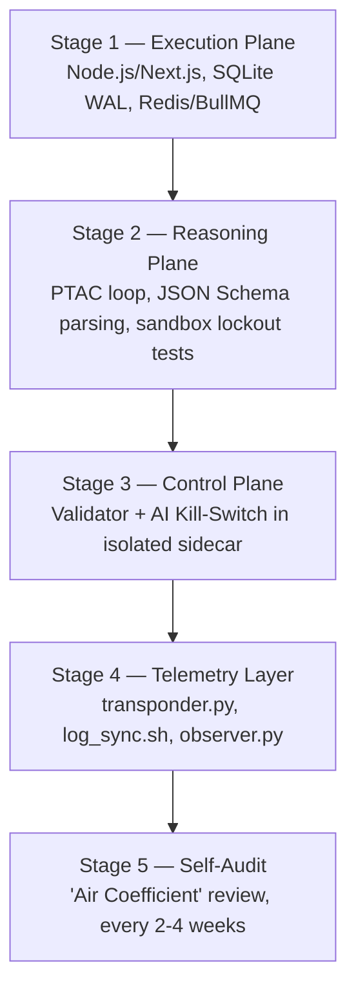

# Assembly Stages

META-CORE is bootstrapped through a cascaded, five-stage deployment plan.
Each stage builds on the previous one's *verified* state — the Reasoning
Plane must not start reasoning before the Execution Plane's queues exist to
receive its output, and dispatches must not run before the Control Plane's
safety sidecar is live.

## Stage 1 — Execution Layer

Build the monolithic Next.js/Node.js backend, initialize SQLite in WAL mode,
and bring up Redis/BullMQ with concurrency locks.

**Success criteria**
- [ ] Asynchronous BullMQ task processing verified, at-least-once delivery
- [ ] Sub-100ms CRUD performance confirmed for core state mutations
- [ ] Zero write race conditions under parallel load

Full detail: [Execution Plane](../architecture/execution-plane.md).

## Stage 2 — Reasoning Loop (PTAC)

Wrap LLM calls inside `agent.py`'s PTAC cycle, enforce the sandbox's
network/DB isolation, and validate outputs against JSON Schema 2020-12.

**Success criteria**
- [ ] Sandbox confirmed isolated — network sockets blocked, no DB credentials
      present in the process environment
- [ ] Every Decision Packet round-trips through schema validation before
      leaving the sandbox

Full detail: [Reasoning Plane](../architecture/reasoning-plane.md).

## Stage 3 — Governance and Safeguards

Deploy `validator.py` (L-E-J-D-A-S) and the AI Kill-Switch inside an
isolated sidecar container, fully out-of-process from the reasoning sandbox.

**Success criteria**
- [ ] Complete process isolation confirmed — a sandbox-side compromise
      cannot reach the sidecar
- [ ] Kill-Switch verified to terminate the sandbox even under
      100%-CPU-saturated conditions

Full detail: [Control Plane](../architecture/control-plane.md) and
[L-E-J-D-A-S framework](../security/l-e-j-d-a-s-framework.md).

## Stage 4 — Observability and Telemetry Pipeline

Bring up `transponder.py` (atomic `flush + os.fsync` writes),
`log_sync.sh` on a 5-minute `systemd` timer, and `observer.py` for passive
anomaly detection and Trace DAG construction.

**Success criteria**
- [ ] Functional Trace DAG generation confirmed
- [ ] Z-score / Huber Loss anomaly filtering operating on live telemetry

Full detail: [Observability Plane](../architecture/observability-plane.md).

## Stage 5 — Regular Self-Audit ("Air Coefficient")

A recurring, bi-weekly (2–4 week cadence) review against code-base decay —
this stage never "completes," it repeats for the life of the deployment.

**Checklist**
- [ ] Abstraction pruning — remove unused interfaces / speculative
      "future-proofing" code
- [ ] Naming alignment — class and module names match the current blueprint
- [ ] Blueprint verification — deployed state cross-referenced against the
      deterministic Knowledge Object model

## Why sequential, health-gated boot

Starting Stage 2 before Stage 1's database schema exists causes fatal
file-locking or missing-file crashes when `agent.py` tries to read initial
parameters. Starting Stage 1's execution API before Stage 3's sidecar is
healthy would let the system accept Decision Packets with no validator to
check them. Both failure modes are closed by gating each stage's public
entry point on the previous stage's health check rather than a fixed boot
delay. See [ADR-0008](../decisions/0008-sequential-health-gated-bootstrap.md).

## Open questions

- The exact commands/parameters for Stage 1's concurrency and write-lock
  test suite.
- How Stage 1's Zod schema definitions are kept in sync with Stage 2's
  JSON Schema definitions as tools evolve.

See [`docs/open-questions.md`](../open-questions.md) for the full list.
