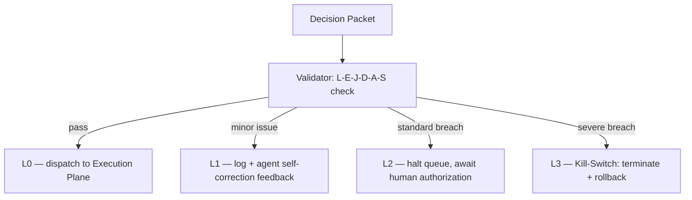

# The L-E-J-D-A-S Framework and L0–L3 Escalation

> **Note on status:** the source design specifies the field names, the
> escalation levels, and the monitored resource signals, but not the
> concrete evaluation logic, numeric thresholds, or scoring rules behind
> them. The tables below define what each field and level *means*
> architecturally; implementing the actual pass/fail logic inside
> `validator.py` is open work — tracked in
> [`docs/open-questions.md`](../open-questions.md).

## The six safety fields

Every Decision Packet is evaluated by `validator.py`, in the isolated
Control Plane sidecar, against six dimensions before it can reach the
Execution Plane:

| Field | Dimension | Checks |
|---|---|---|
| **L** | Legal | Compliance with statutory and regulatory limits |
| **E** | Ethical | Bias mitigation, harm-reduction guidelines |
| **J** | Jurisdictional | The action stays within the current geographic/territorial boundary |
| **D** | Duty | The action serves the agent's assigned mission — mission alignment |
| **A** | Accountability | A verifiable Ed25519 cryptographic signature and provenance trail exist |
| **S** | Safety | Resource usage and physical hazard limits |

## L0–L3 escalation ladder

A Decision Packet's evaluation result is mapped onto a severity ladder so
the system can respond proportionally instead of hard-crashing on every
minor issue:

| Level | Severity | Trigger | System action |
|---|---|---|---|
| **L0** | Normal | Passes all L-E-J-D-A-S checks | Released to the Execution Plane for commit |
| **L1** | Minor warning | Marginal resource/evaluation variance | Logged to `event_stream.jsonl`; agent receives feedback for self-correction |
| **L2** | Operational halt | Breach of a standard financial cap or a non-critical ethical constraint | Queue execution halted via BullMQ; agent suspended pending human authorization |
| **L3** | Fatal interdict | Severe ethical failure or major financial-risk violation | AI Kill-Switch triggered; sandbox process terminated; active transactions rolled back |

## The AI Kill-Switch: monitoring *how*, not *what*

The Validator checks the *content* of a proposed action. The Kill-Switch
separately, continuously monitors the *behavior* of the reasoning process
itself, independent of any single Decision Packet:

| Signal | Failure mode it catches |
|---|---|
| Execution time | Runaway or hung planning cycles |
| Memory footprint | Host resource exhaustion |
| Token consumption | Uncontrolled LLM billing |
| Cyclic / recursive loops | Infinite logic loops, redundant tool calls |

It runs as an active, out-of-process sidecar monitor (Stage 3) and works
alongside — but is architecturally distinct from — `observer.py`'s
**passive** trace-DAG loop detection (Stage 4), which analyzes completed
execution history rather than intervening live. See
[Control Plane](../architecture/control-plane.md) and
[Observability Plane](../architecture/observability-plane.md).

## Open questions

- The concrete algorithm and thresholds distinguishing L0 from L1, L1 from
  L2, and L2 from L3.
- Whether an L1/L2 rejection is fed back to `agent.py` to drive an automatic
  corrective PTAC retry, or requires a human in the loop.
- The exact numeric ceilings for execution time, memory, token count, and
  loop-repetition count before the Kill-Switch fires.
- The signal used to terminate the sandboxed process (`SIGKILL`, `SIGTERM`,
  or a sidecar-issued stop request).
- Rollback/state-recovery protocol for a transaction cut off mid-execution
  by an L3 kill.

See [`docs/open-questions.md`](../open-questions.md) for the full,
consolidated list.
